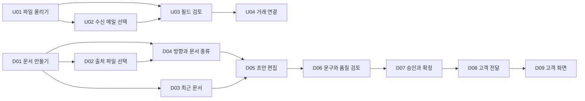

# ERP 서류 처리 화면설계

이 문서는 원소스 기능명세를 현재 로컬 프로토타입의 화면과 상태에 연결한 화면설계 인덱스다. 화면 이미지는 `1695 x 1210` 기준으로 캡처한 뒤 단일 SVG 안에 포함했다.

## 최신 기획서와 상태별 캡처 · 2026-09-15

- [3030 G53 문서 상태 샘플 10개](./g53-local-case-preview.md): 최신 요청 대상 앱의 실제 캡처와 재시도·삭제 동작.

- [주요 6개 페이지 디자인 요청서](./primary-pages-design-request.md): 요청사항과 기본·선택·오류·완료·빈 상태의 실제 캡처.
- [파일 올리기 화면설계](./file-upload-screen-spec.md): 2분할 검토·PDF, 처리 중·실패·재시도, 모바일 전환.
- [문서 만들기 화면설계](./document-create-screen-spec.md): 품목 추가·계산·개별 삭제·전체 삭제·다시 추가.
- [전체 캡처 갤러리](./screen-states.html): 브라우저에서 상태별로 크게 보기.

기존 SVG는 이전 버전이며 새 PNG 캡처가 최신 로컬 구현 기준입니다.

- [매직링크 수신 화면](./magic-link-recipient-screen-spec.md): 독립 공개 페이지, 패키지·PDF, 링크 상태별 디자인과 API 연동 범위. `/share/preview`에서 확인.

## 기준 문서

- 기능 SSOT: [`../source-functional-checklist.md`](../source-functional-checklist.md)
- 로컬 구현 점검: [`../local-prototype-gap-checklist.md`](../local-prototype-gap-checklist.md)
- 전체 기능 매핑: [`functional-coverage-matrix.md`](./functional-coverage-matrix.md)
- 파일 올리기 화면설계: [`file-upload-screen-spec.md`](./file-upload-screen-spec.md)
- 문서 만들기 화면설계: [`document-create-screen-spec.md`](./document-create-screen-spec.md)

## 전체 흐름

## 화면 목록

| ID | 화면 | 핵심 목적 | 캡처 |
|---|---|---|---|
| U01 | 파일 올리기 최초 진입 | 직접 업로드, 폴더, 수신 메일 유입 | [`01-file-upload-entry.svg`](./assets/01-file-upload-entry.svg) |
| U02 | 수신 메일 첨부 선택 | 메일 한 건의 여러 첨부를 골라 파일 목록에 추가 | [`02-email-forward-in.svg`](./assets/02-email-forward-in.svg) |
| U03 | 필드 검토와 PDF 대조 | OCR 필드 수정, 신뢰도 확인, 원문 위치 대조 | [`03-file-field-review.svg`](./assets/03-file-field-review.svg) |
| U04 | 거래 연결 | 거래 후보 결정, 거래처 매핑, 문서 보관 정책 확인 | [`04-file-deal-link.svg`](./assets/04-file-deal-link.svg) |
| D01 | 문서 만들기 최초 진입 | 자연어 요청과 템플릿으로 초안 시작 | [`05-document-create-entry.svg`](./assets/05-document-create-entry.svg) |
| D02 | 출처 파일 선택 | 확정된 업로드 문서를 N개 선택해 초안 근거로 사용 | [`06-document-source-files.svg`](./assets/06-document-source-files.svg) |
| D03 | 최근 문서 목록 | 작성 중, 확정, 완료 문서 조회와 재진입 | [`07-document-recent-list.svg`](./assets/07-document-recent-list.svg) |
| D04 | 방향과 문서 종류 | 매입·매출 방향 및 지원 문서 유형 선택 | [`09-document-type-step.svg`](./assets/09-document-type-step.svg) |
| D05 | 초안 편집 | 필드, 품목, 문서 스타일과 PDF를 한 화면에서 편집 | [`08-document-editor.svg`](./assets/08-document-editor.svg) |
| D06 | AI 문구 다듬기 | 문구 편집과 검증 결과 반영 | [`10-document-copy-polish.svg`](./assets/10-document-copy-polish.svg) |
| D07 | 승인과 확정 | 역할별 승인·반려, 이력, 확정 게이트 | [`11-document-approval.svg`](./assets/11-document-approval.svg) |
| D08 | 고객 전달 | 패키지 확인, Magic Link, 이메일 전달 | [`12-customer-delivery.svg`](./assets/12-customer-delivery.svg) |
| D09 | 고객 화면 미리보기 | 실제 공개 페이지와 동일한 전체 화면 검토 | [`13-customer-preview.svg`](./assets/13-customer-preview.svg) |

## 화면설계 원칙

1. **장소와 액션을 분리한다.** 파일 올리기와 문서 만들기는 메뉴의 안정된 작업 공간이고, 업로드·확정·승인 요청·고객 전달은 상태를 바꾸는 액션이다.
2. **한 화면에서 다음 행동이 보이게 한다.** 필드 검토 중에는 거래 연결, 작성 중에는 승인 요청, 승인 완료 후에는 고객 전달만 주요 버튼으로 노출한다.
3. **같은 정보를 중복 표시하지 않는다.** 단계·분류·상태는 한 위치에서만 설명하고, 본문은 사용자가 수정하거나 결정해야 하는 값에 집중한다.
4. **PDF와 필드는 같은 작업의 두 면이다.** 필드가 왼쪽, PDF가 오른쪽에 있으며 경계선을 드래그해 작업 폭을 바꾼다.
5. **저장은 흐름을 막지 않는다.** 필드는 지연 자동 저장하고, 입력 안쪽에 저장 중·저장 완료·실패 상태를 표시한다. 상단 저장은 명시적 스냅샷 저장이다.
6. **운영 실패를 화면 상태로 다룬다.** 중복, 권한, 보안 문서, OCR 실패, 잘못된 거래 연결, 만료 링크 등은 메시지만 띄우지 않고 재시도·제외·되돌리기 액션을 함께 제공한다.

## 캡처 사용 안내

SVG는 프로토타입의 실제 화면을 담은 자체 포함형 이미지다. 문서 이동이나 Notion 가져오기 시 별도 PNG 경로가 필요하지 않지만, 개별 UI 요소를 벡터로 편집하는 설계 원본은 아니다.
