# 문서 만들기 화면설계

> 품목 추가·삭제의 최신 동작은 아래 [상태별 실제 캡처](#화면-상태별-실제-캡처--2026-09-15)를 기준으로 확인합니다. 기존 SVG는 이전 버전 참고입니다.

## 목적

자연어 요청, 확정된 출처 파일, 거래 데이터와 템플릿을 조합해 업무 문서를 만들고 검토·승인·확정한 뒤 고객에게 전달한다. 완전히 빈 문서는 상세 편집 단계로 진입하지 않으며, 방향·문서 종류·최소 필수값 중 하나 이상의 유효한 시작 근거가 필요하다.

## 상태 흐름

| 단계 | 사용자 목표 | 주요 버튼 | 다음 단계 조건 |
|---|---|---|---|
| 1 방향 | 매입·매출 업무 방향 결정 | 다음 | 방향 선택 |
| 2 문서 | 문서 종류와 출처 결정 | 이 양식으로 작성 | 지원 문서 종류 선택 |
| 3 작성 | 필드·품목·문구·스타일 완성 | 승인 요청 | 필수값과 품질 게이트 통과 |
| 승인 | 오너·관리자가 검토 | 승인, 반려 | 승인 완료 |
| 확정 | 승인된 내용을 불변 문서로 확정 | 문서 확정 | PDF 생성 성공 |
| 4 전달 | 패키지와 수신처를 확인해 전송 | 고객 전달 | 전달 준비 조건 충족 |

## D01. 문서 만들기 최초 진입

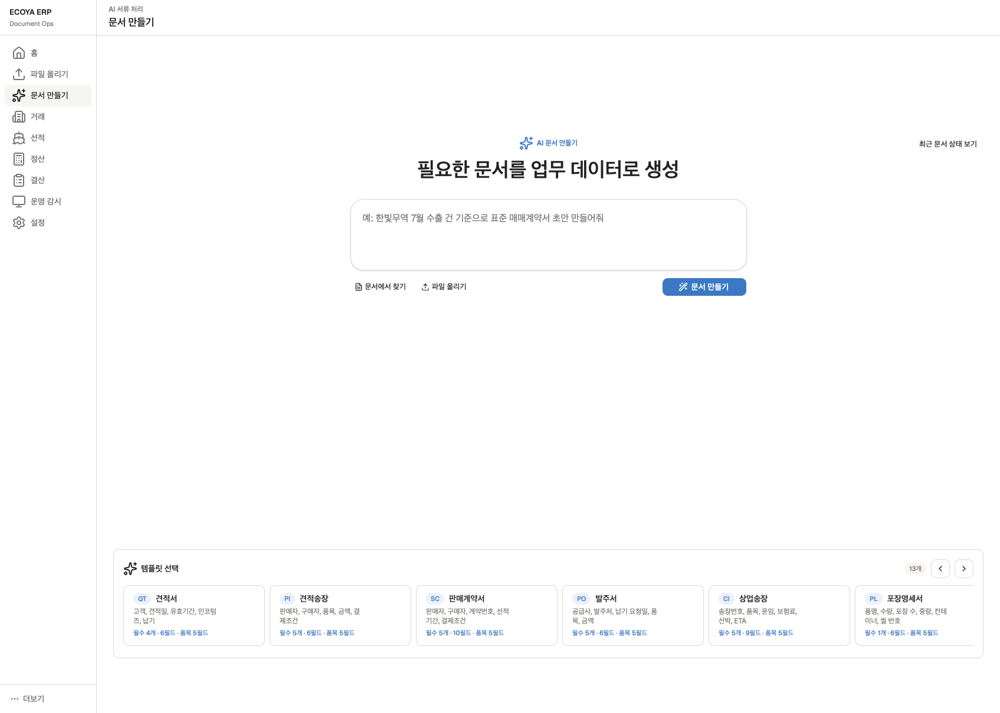

### 화면 구성

- 중앙 입력창: 만들 문서와 목적을 자연어로 입력한다.
- 입력창 아래 보조 액션: `문서에서 찾기`, `파일 올리기`.
- 주요 액션: 파란색 `문서 만들기`.
- 하단: `템플릿 선택` 가로 캐러셀. 화면 폭에 맞춰 노출 개수가 늘고 좌우 이동과 전체 개수를 제공한다.
- 문서가 한 건이라도 생기면 하단에 최근 문서 테이블이 추가된다. 최초 접근에는 최근 문서 영역을 만들지 않는다.

### 입력 검증

- 요청이 비어 있고 출처 파일과 템플릿도 선택하지 않았으면 시작하지 않는다.
- 모호한 요청은 문서 방향, 문서 종류, 거래처 등 최소 질문을 먼저 제시한다.
- 긴 입력은 자동으로 높이가 커지되 최대 높이 이후 내부 스크롤한다.
- 생성 중 중복 클릭을 막고 진행·취소·재시도 상태를 입력창 안에서 표시한다.
- 지원하지 않는 문서 요청은 가능한 유형을 제안하고 상세로 진입하지 않는다.

### 템플릿 선택

| 코드 | 문서 | 대표 필드 |
|---|---|---|
| QT | 견적서 | 고객, 견적일, 유효기간, 인코텀즈, 납기 |
| PI | 견적송장 | 판매자, 구매자, 품목, 금액, 결제조건 |
| SC | 판매계약서 | 판매자, 구매자, 계약번호, 선적기간, 결제조건 |
| PO | 발주서 | 공급사, 발주처, 납기 요청일, 품목, 금액 |
| CI | 상업송장 | 송장번호, 품목, 운임, 보험료, 선박, ETA |
| PL | 포장명세서 | 품명, 수량, 포장 수, 중량, 컨테이너, 씰 |
| SI | 선적지시서 | 송하인, 수하인, 부킹번호, 선적항, 도착항 |
| BC | 수익자증명서 | 수익자, 개설의뢰인, L/C 번호, 증명 문구 |
| DLV | 납품서 | 납품처, 납품일, 품목, 배송지, 차량번호 |
| CO | 원산지증명서 | 수출자, 수입자, 원산지, 운송수단, 신고 정보 |
| SOA | 거래명세서 | 거래처, 기간, 청구 합계, 수금 합계, 잔액 |
| DN | 차변표 | 관련 인보이스, 조정 금액, 통화, 사유 |
| CN | 대변표 | 관련 인보이스, 감액 금액, 통화, 사유 |

카드를 클릭하면 바로 선택되고 배경과 외곽선이 바뀐다. CTA는 카드 폭을 침범하지 않으며 선택한 템플릿으로 상세 흐름을 시작한다.

## D02. 출처 파일 선택

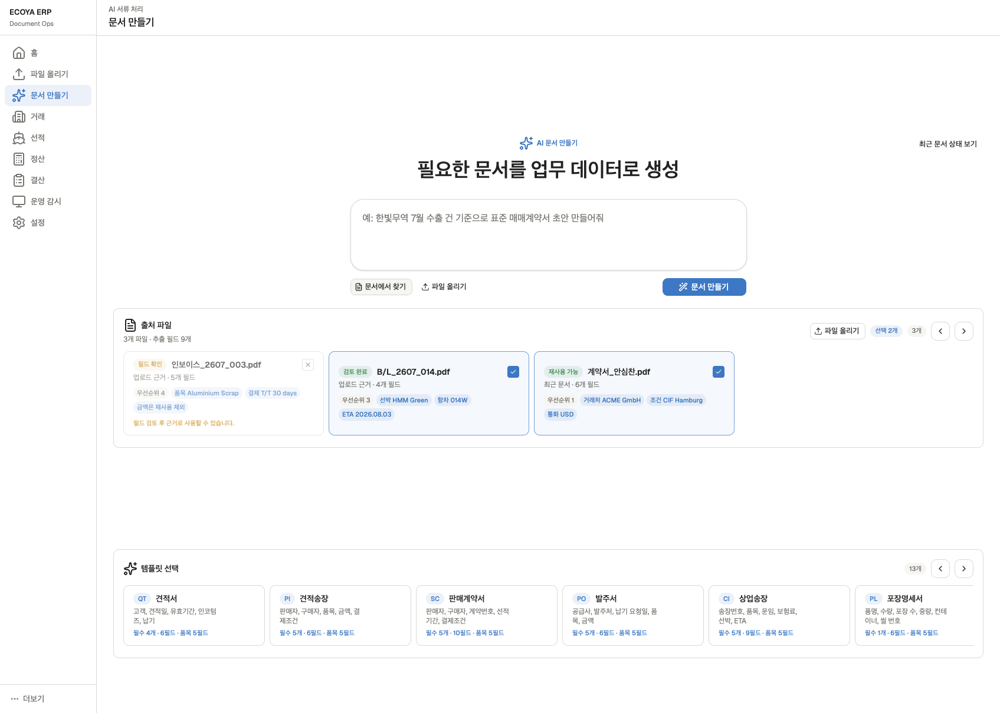

### 화면 구성과 규칙

- `문서에서 찾기`를 누르면 입력창 바로 아래에서 전체 가로 폭으로 열린다. 위 콘텐츠를 밀어 올리지 않고 아래 콘텐츠를 자연스럽게 밀어낸다.
- 확정된 업로드 문서를 N개 선택할 수 있으며 카드에 문서 유형, 상태, 추출 필드 수와 주요 필드를 표시한다.
- 선택 우선순위는 거래 문맥에 따라 PO, SC, B/L, CI, PL 순으로 제안하되 사용자가 바꿀 수 있다.
- 자동 초안 근거는 최대 3개를 권장하고, 그 이상은 충돌 가능성을 안내한다.
- 금액 등 민감 필드를 근거에서 제외하거나 특정 필드만 포함할 수 있다.
- `파일 올리기`는 출처 파일 헤더의 앞쪽에 배치하고 파일 올리기 작업 공간으로 연결한다.
- 선택 파일이 삭제·미확정·권한 상실 상태가 되면 생성 전 다시 검증한다.

## D03. 최근 문서 목록

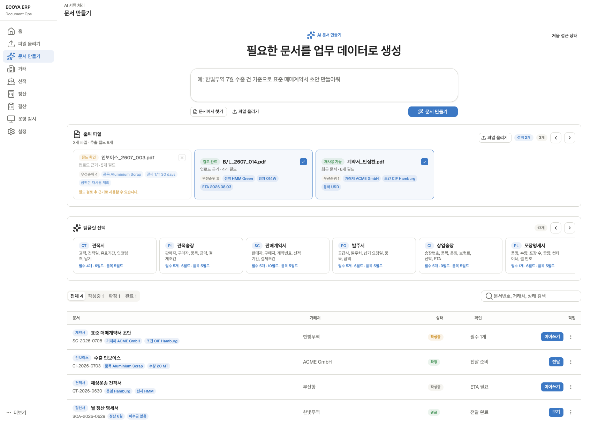

### 테이블

- 필터: 전체, 작성 중, 확정, 완료.
- 열: 문서명·유형, 거래처, 상태, 필요한 확인, 주요 작업, 케밥 메뉴.
- 행 선택은 상세로 이동한다. 별도 미리보기 버튼은 두지 않는다.
- 작업 열의 주요 버튼은 항상 노출한다: `이어쓰기`, `승인`, `전달`, `보기` 중 현재 상태에 맞는 하나.
- 케밥 메뉴는 항상 노출하고 복제, 이름 변경, 삭제, PDF 다운로드 등 보조 액션을 넣는다.
- 하단 문서 네비게이션은 페이지 크기와 이전·다음을 제공한다.
- 목록·필터·페이지는 URL 또는 로컬 상태로 복원한다.

## D04. 방향과 문서 종류

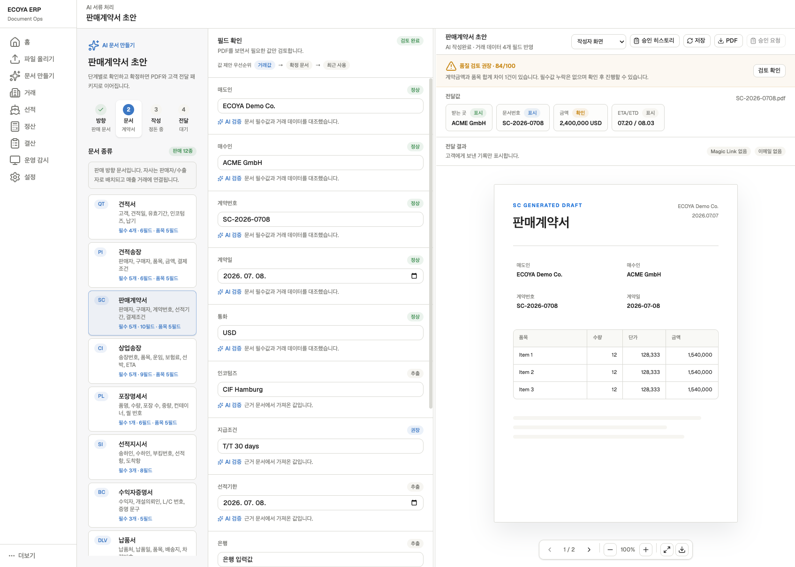

### 방향별 유형

- 매출 방향: QT, PI, SC, CI, PL, SI, BC, DLV, CO, SOA, DN, CN.
- 매입 방향: 위 유형과 PO를 포함한다.
- 방향을 바꾸면 현재 문서 유형이 새 방향에서 유효한지 확인하고, 유효하지 않으면 재선택을 요구한다.
- 상세 화면에서 방향과 문서 종류를 변경할 수 있지만 이미 입력한 필드가 사라질 경우 변경 영향과 되돌리기를 먼저 보여준다.

### 밀도

13개 문서 유형은 고정 높이 목록으로 촘촘하게 표시하고 전체 영역에 독립 스크롤을 적용한다. 선택 유형은 외곽선과 배경으로 구분하며 하단 주요 버튼은 고정한다.

## D05. 초안 편집

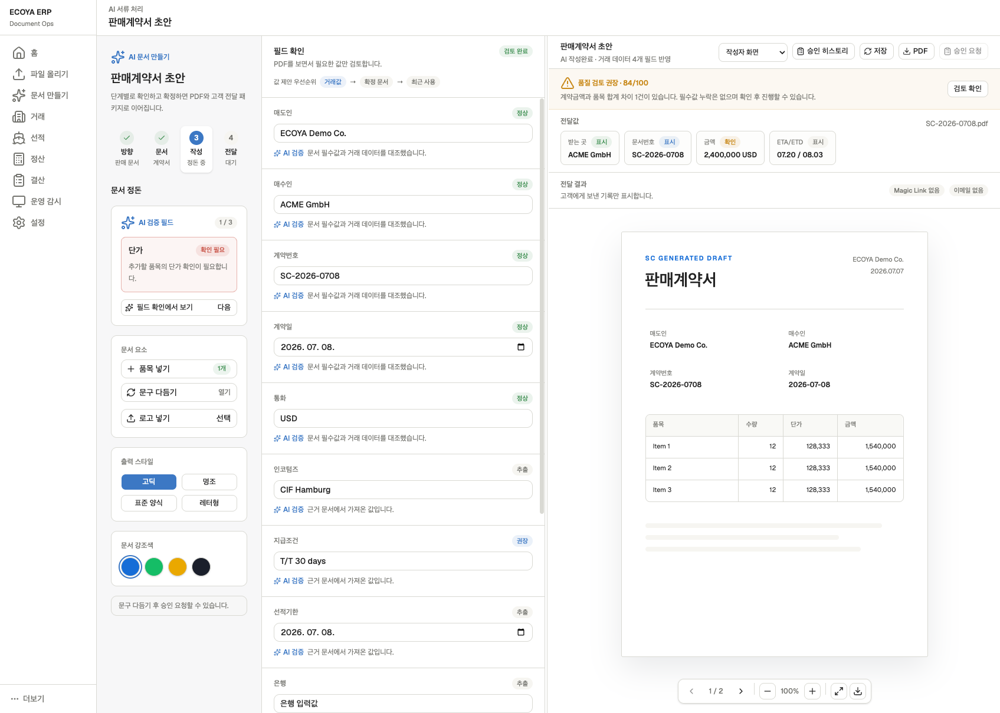

### 3열 작업 공간

1. 왼쪽 `문서 정돈`: 단계, AI 검증 우선순위, 문서 요소, 출력 스타일, 강조색.
2. 가운데 `필드 확인`: 문서 스키마의 모든 입력과 품목 행.
3. 오른쪽 `문서 미리보기`: 현재 필드와 스타일이 반영된 PDF.

가운데와 오른쪽 경계는 얇은 드래그 선으로만 표시한다. 폭 조절은 최소·최대 폭을 가지며 더블클릭하면 기본값으로 돌아간다.

### 필드 타입

- text, textarea, number, currency+currency select, quantity+unit select.
- date, datetime, select, multi-select, counterparty lookup.
- account, address, port, vessel, container, incoterms 등 도메인 필드.
- 반복 가능한 line items와 첨부·로고 파일.
- 필드 포커스 시 최근 사용, 거래값, 확정 문서값, 출처 파일 추출값을 팝오버로 제안한다. 제안 제목을 반복 노출하지 않는다.

### 품목

- 품목은 단일 필드가 아니라 반복 행 그룹으로 열린 상태를 유지한다.
- 각 행: 품목명, 수량+단위, 단가+통화, 자동 계산 금액, AI 검증, 삭제.
- 품목 영역 상단에 `품목 추가`를 항상 표시한다. 클릭하면 빈 행을 추가하고 새 품목명으로 포커스를 이동한다.
- 각 행 우측에 아이콘과 `삭제` 텍스트 버튼을 표시한다. 가로 스크롤 시 삭제 열은 오른쪽에 고정한다.
- 개별 삭제는 선택한 행만 제거하며 다른 행의 입력값·계산값을 유지한다.
- 전체 삭제 후에도 `품목 추가`를 유지하고 `되돌리기`로 삭제된 행을 복구한다. 품목 필수 문서는 품목 0개를 검토 완료로 계산하지 않는다.
- 문서 요소의 품목 배지는 저장 완료된 유효 행 개수를 표시한다.
- 단가·수량 변경 시 행 금액과 계약 합계를 다시 계산하고 불일치 검증을 갱신한다.
- 추가·삭제·복구 시에도 문서 변경 상태를 갱신한다. 현재 로컬 시안은 즉시 삭제하고, 전체 삭제 후 되돌리기를 제공한다. 서버 저장·이탈 복구는 별도 연동 검증 대상이다.

### 문서 요소

- `품목 넣기`: 품목 그룹으로 이동해 새 행 추가.
- `문구 다듬기`: D06 오버레이 열기.
- `로고 넣기`: 조직 로고 사용 또는 PNG/JPG 파일 올리기. 완료 후 선택 UI를 닫고 완료 표시.
- 각 요소는 시작 전, 진행 중, 완료, 오류 상태를 가진다.

### 출력 스타일과 강조색

- 출력 스타일과 강조색은 각각 독립 영역으로 유지한다.
- 스타일: 고딕, 명조, 표준 양식, 레터링.
- 강조색: 원소스 문서 색상 토큰을 사용하고 선택 결과를 PDF와 고객 공개 화면에 함께 반영한다.

### 저장

- 필드 입력 후 짧은 debounce로 자동 저장한다.
- 입력 안쪽 우측에 저장 중 스피너, 완료 체크, 실패 아이콘을 표시한다.
- 상단 `저장`은 자동 저장 대기분을 포함해 즉시 서버에 저장한다.
- 페이지 이탈 시 저장 대기 또는 실패가 있으면 확인한다.

## D06. 문구와 품질 검토

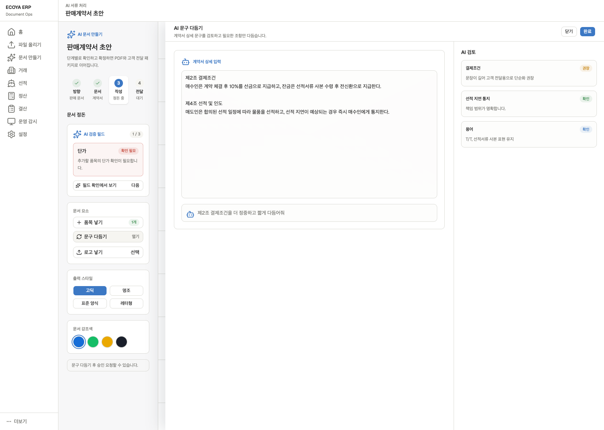

### 문구 다듬기

- 가운데 필드와 오른쪽 초안 영역을 가리는 작업 오버레이로 연다.
- 원문, AI 제안, 사용자의 추가 지시를 한 흐름에서 비교한다.
- 적용 범위를 전체 문서 또는 선택 문구로 지정한다.
- 완료하면 변경 내용을 반영하고 오버레이를 닫아 D05로 돌아간다.
- 적용 전후 diff와 실행 취소를 제공한다.

### 품질 검증

- 오류 우선순위: 차단 오류(빨강) → 확인 권장(주황) → 정보(파랑).
- 검증 항목을 선택하거나 `필드 확인에서 보기`를 누르면 가운데의 정확한 필드 또는 품목 행으로 스크롤하고 포커스한다.
- 필수 누락, 계산 불일치, 거래·출처 충돌, 전송값 누락, 문서 형식 오류를 구분한다.
- 하단에 중복 AI 검증 요약을 두지 않고 필드와 상단 품질 게이트에서만 상태를 표시한다.

## D07. 승인과 확정

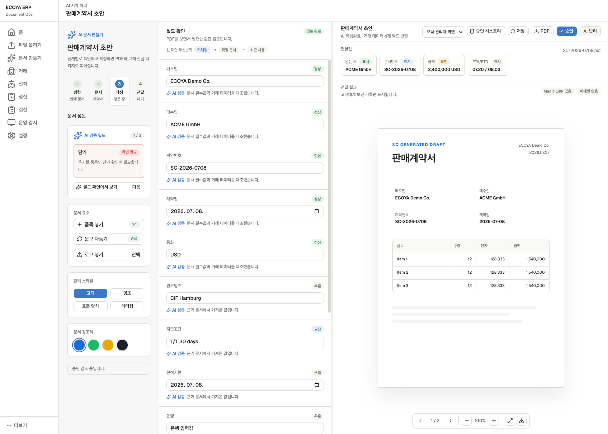

### 역할별 액션

| 역할·상태 | 상단 주요 액션 |
|---|---|
| 작성자, 작성 중 | 승인 요청 |
| 작성자, 승인 대기 | 요청 취소 또는 대기 상태 |
| 오너·관리자, 승인 대기 | 승인, 반려 |
| 작성자, 반려 | 반려 사유 확인, 수정 후 재요청 |
| 승인 완료 | 문서 확정 |
| 확정 완료 | 고객 전달. `문서 확정`은 사라짐 |

### 승인 규칙

- 문구 다듬기와 필수 품질 게이트를 통과해야 승인 요청이 활성화된다.
- 반려 시 사유는 필수이며 문서 상단 상태와 승인 히스토리에서 확인한다.
- 승인 히스토리는 요청·승인·반려·취소·재요청의 사용자와 시간을 기록한다.
- 승인 후 필드 변경은 승인을 무효화하고 재요청이 필요하다.
- 확정은 승인된 버전 스냅샷과 PDF를 원자적으로 생성한다.

## D08. 고객 전달 작업대

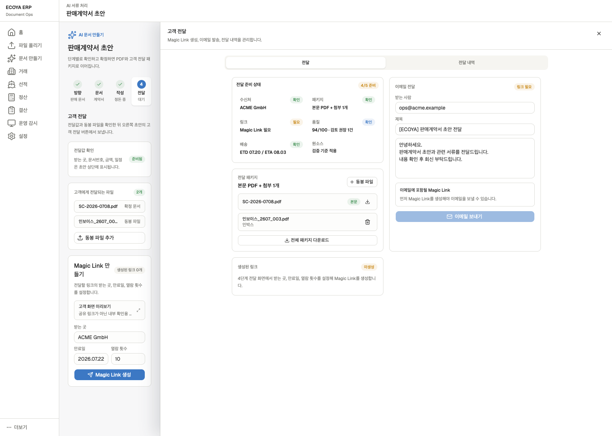

### 표시 방식

고객 전달 버튼을 누르면 오른쪽 본문 전체를 덮는 slide-over 작업대로 연다. 왼쪽 단계 패널과 전역 내비게이션은 유지해 현재 문서 문맥을 잃지 않는다. 패널은 닫기와 Esc를 지원하며 배경 본문은 조작할 수 없다.

### 전달 준비

- 수신처, 본문 PDF, 첨부, 활성 링크, 품질, 배송 정보의 준비 상태를 압축된 체크리스트로 표시한다.
- 첨부는 확정 문서, 인박스 문서, 직접 업로드를 추가할 수 있다.
- 자동 첨부, 선택 첨부, 첨부 불가 정책을 적용하고 삭제·순서 변경을 제공한다.
- 확정되지 않은 문서나 보안 문서는 고객 패키지에 포함할 수 없다.

### Magic Link

- 받는 곳, 만료일, 최대 열람 횟수를 설정해 여러 링크를 생성한다.
- 생성된 링크는 상태, 만료일, 열람 수와 함께 목록화하고 복사, 새 창 열기, 철회, 삭제를 제공한다.
- 고정 미리보기는 공유 가능한 링크와 구분하고 실제 고객 전체 화면을 내부 미리보기로 연다.
- 철회·만료·최대 열람 초과는 공개 화면에서 각각 안전한 안내를 표시한다.

### 이메일

- 받는 사람을 수정할 수 있고 제목·본문을 편집한다.
- 이메일에 포함할 활성 Magic Link를 선택한다. 링크가 없으면 일반 첨부 이메일 허용 여부를 제품 정책에 따라 명확히 한다.
- 중복 전송 방지, 전송 중, 성공, 일부 실패, 재전송 상태를 제공한다.
- 최근 이메일을 별도 중복 영역에 두지 않고 전달 내역에서 링크 생성·철회와 함께 시간순으로 표시한다.

## D09. 고객 화면 미리보기

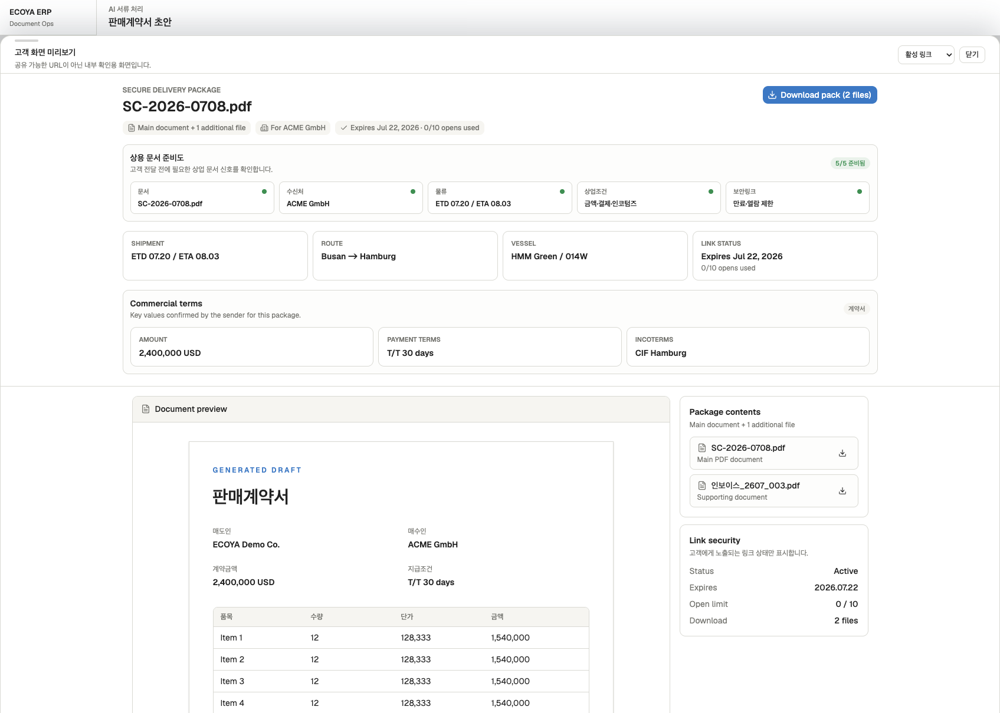

### 원칙

- 패널이 아니라 실제 공개 페이지와 동일한 전체 화면 뷰로 연다.
- 상단에 `내부 미리보기` 표시와 닫기·원래 화면 복귀를 둬 사용자가 주소를 고객에게 공유하지 않게 한다.
- 문서 핵심 정보와 전달된 콘텐츠를 중복 표시하지 않는다.
- 상용 문서 준비도, 핵심 전달값, 본문 PDF와 허용된 첨부 다운로드를 제공한다.

### 공개 상태

- 활성: 문서와 첨부 열람·다운로드.
- 만료: 만료 안내와 발신자 연락 방법.
- 열람 횟수 초과: 접근 종료 안내.
- 철회: 링크가 철회되었다는 최소 정보.
- 존재하지 않음·조직 불일치: 문서 존재를 노출하지 않는 공통 오류.
- 모바일: 문서 핵심 정보, PDF, 첨부 순으로 단일 열 배치.

## 문서 만들기 공통 예외

- 거래·출처 파일이 편집 중 변경되었을 때 stale 데이터 재검증.
- 템플릿 버전 변경과 기존 초안의 스키마 마이그레이션.
- 자동 저장 충돌, 오프라인, 권한 회수, 다른 탭 편집.
- 승인 요청 이중 클릭, 승인자 권한 변경, 승인 직후 필드 변경.
- PDF 생성 실패, 글꼴 누락, 페이지 넘침, 첨부 생성 실패.
- 고객 전달 중 링크 생성 성공·이메일 실패 같은 부분 성공.
- 만료 직전 링크 전송, 철회와 열람의 경쟁 상태.

## 화면 상태별 실제 캡처 · 2026-09-15

수정된 로컬 프로토타입에서 실제 조작해 캡처했습니다. 기본 1440 × 1000이며 다른 폭은 캡션에 표시합니다. 샘플 데이터·처리 시뮬레이션 기준으로, 실제 OCR·원문 파일 로딩·저장 API 성공을 증명하는 화면은 아닙니다. 기존 SVG는 이전 버전 참고입니다.

| 화면 ID | 상태 | 재현 방법 |
|---|---|---|
| [d01-entry](#screen-d01-entry) | 문서 만들기 · 최초 진입 | 메뉴 → 문서 만들기 |
| [d05-empty](#screen-d05-empty) | 문서 만들기 · 직접 입력 | 견적서 선택 → 품목 영역 상단에 품목 추가 |
| [d05-added](#screen-d05-added) | 문서 만들기 · 품목 추가·계산 | 품목 추가 → 새 행 입력 → 24,000 / 200 USD 계산 |
| [d05-deleted](#screen-d05-deleted) | 문서 만들기 · 개별 삭제 | 첫 행 삭제 → Copper Scrap 행 유지 |
| [d05-no-items](#screen-d05-no-items) | 문서 만들기 · 품목 없음 | 전체 삭제 → 품목 없음 / 되돌리기 / 품목 추가 |
| [d05-readded](#screen-d05-readded) | 문서 만들기 · 삭제 후 추가 | 품목 없음 → 품목 추가 → 새 빈 행 |

### d01-entry · 문서 만들기 · 최초 진입

진입: 메뉴 → 문서 만들기. 화면 폭: 1440 × 1000.

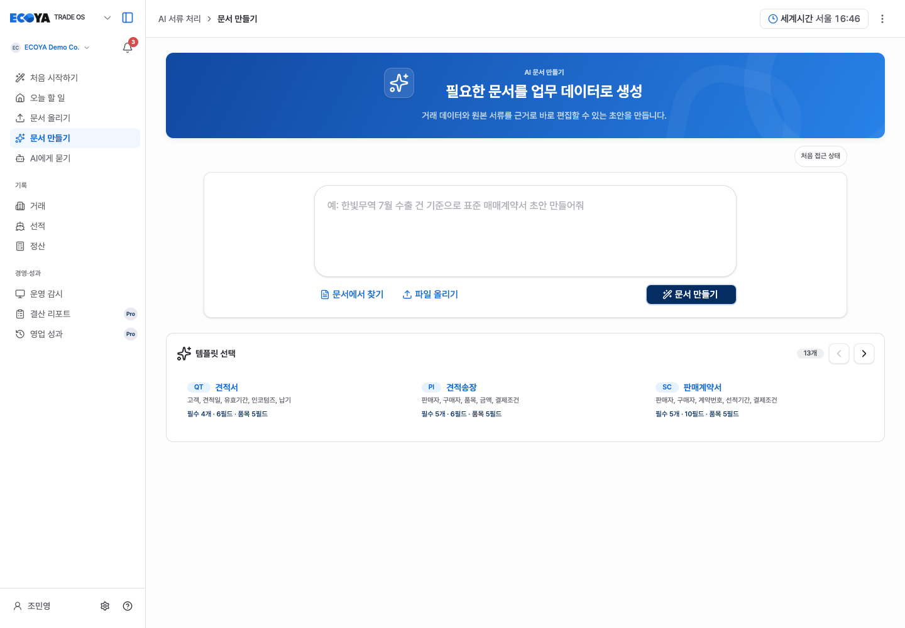

### d05-empty · 문서 만들기 · 직접 입력

진입: 견적서 선택 → 품목 영역 상단에 품목 추가. 화면 폭: 1920 × 1080.

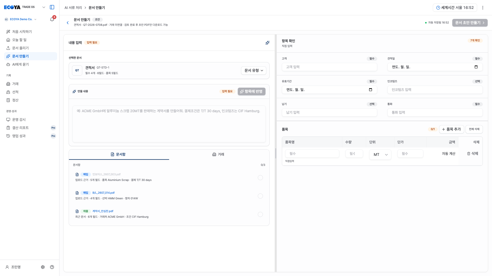

### d05-added · 문서 만들기 · 품목 추가·계산

진입: 품목 추가 → 새 행 입력 → 24,000 / 200 USD 계산. 화면 폭: 1920 × 1080.

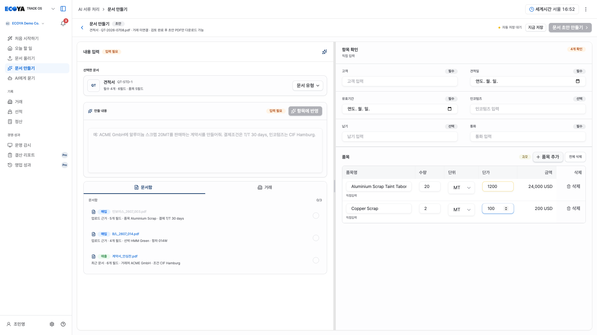

### d05-deleted · 문서 만들기 · 개별 삭제

진입: 첫 행 삭제 → Copper Scrap 행 유지. 화면 폭: 1920 × 1080.

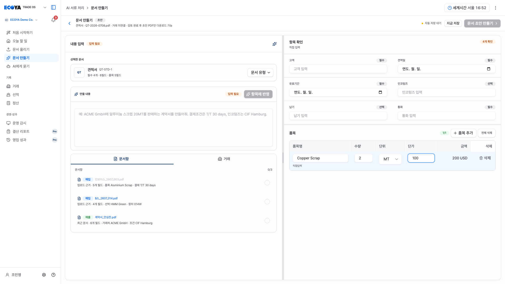

### d05-no-items · 문서 만들기 · 품목 없음

진입: 전체 삭제 → 품목 없음 / 되돌리기 / 품목 추가. 화면 폭: 1920 × 1080.

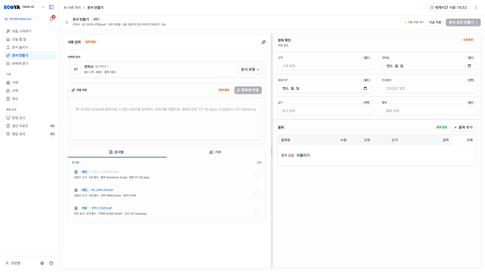

### d05-readded · 문서 만들기 · 삭제 후 추가

진입: 품목 없음 → 품목 추가 → 새 빈 행. 화면 폭: 1920 × 1080.

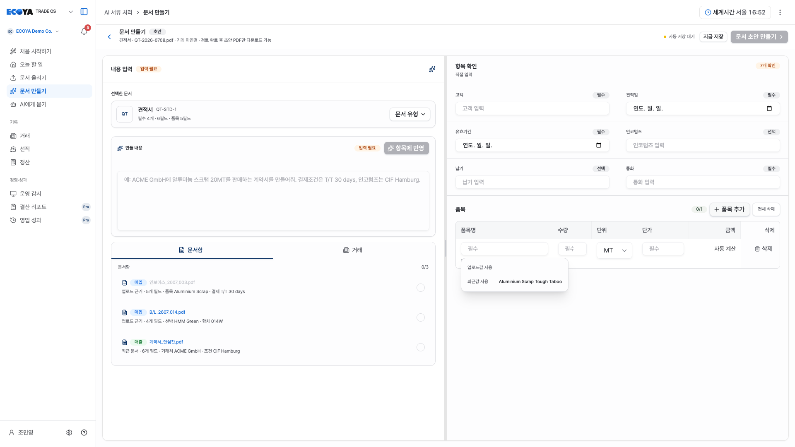

### d05-mobile · 모바일 품목 조작

390 × 844. `항목 확인` 선택 후 품목을 추가·삭제합니다. 표 안에서만 가로 스크롤하고 삭제 열은 오른쪽에 고정합니다.

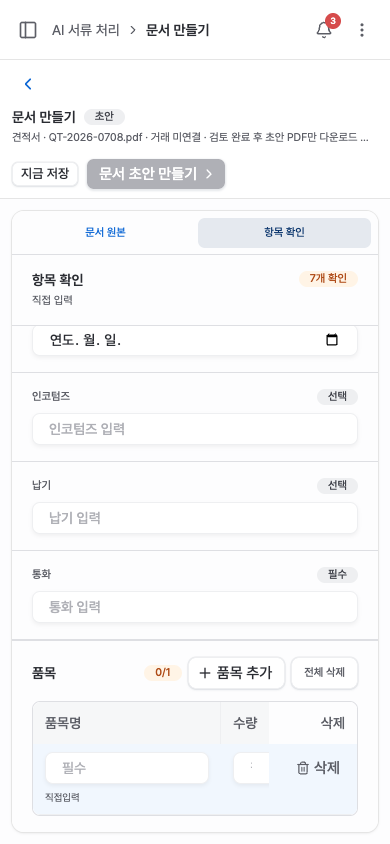

## 2026-09-17 사용자 지시 반영

문서 만들기 진입부의 자유입력 프롬프트와 추가 질문/중복 원본 선택을 제거한다.
폼 13개를 카드로 바로 선택하고, 선택 후 기존 문서 편집기에서 자료와 필드를
검토한다. 거래 상세에서 진입한 거래 연결 문맥은 유지한다. 이전 본문의
상단 프롬프트 관련 서술보다 이 결정이 우선한다.
