# 파일 올리기 화면설계

> 최신 상태별 실제 화면은 [2026-09-15 캡처](#화면-상태별-실제-캡처--2026-09-15)를 기준으로 확인합니다.

## 목적

PDF를 직접 올리거나 폴더·조직 수신 메일에서 가져온 뒤, OCR 결과를 검토하고 올바른 거래에 연결한다. 파일 유입과 필드 검토는 같은 작업 공간에서 이어지며, 거래 연결이 완료될 때까지 ERP 거래·정산 데이터에는 반영하지 않는다.

## 상태 흐름

| 상태 | 진입 조건 | 주요 액션 | 완료 조건 |
|---|---|---|---|
| 유입 전 | 최근 파일 없음 또는 새 업로드 시작 | 파일 올리기, 폴더, 이메일에서 찾기 | 한 개 이상 유효한 파일 수락 |
| 업로드·OCR 중 | 파일 수락 후 | 취소, 실패 항목 재시도 | 문서 분류와 필드 추출 완료 |
| 필드 확인 | OCR 완료 | 필드 수정, PDF 대조, 저장 | 필수 Trigger 필드 충족 |
| 거래 연결 | 필드 확인 완료 | 거래 후보 선택, 거래처 등록·매핑, 첨부 정책 확인 | 거래 연결 커밋 성공 |
| 완료·제외 | 연결 완료 또는 취급 제외 | 다시 열기, 삭제, 이력 확인 | 최종 상태 기록 |

## U01. 파일 올리기 최초 진입

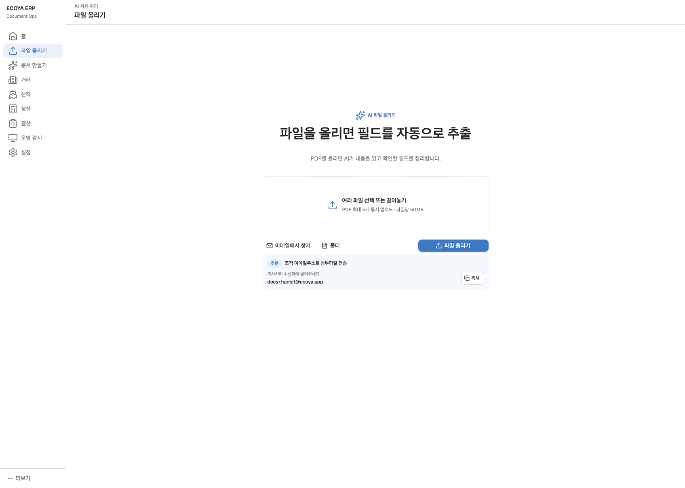

### 화면 구성

- 중앙 진입부: AI 파일 올리기 제목, 지원 형식·개수·용량, 드래그 앤 드롭 영역.
- 보조 유입: `이메일에서 찾기`, `폴더`.
- 주요 액션: 파란색 `파일 올리기`.
- 조직 수신 주소: `docs+<조직슬러그>@ecoya.app`와 복사 버튼. 제목과 첨부파일만 저장된다는 범위를 함께 안내한다.
- 업로드가 시작되면 드롭 영역 안에서 파일별 진행률·성공·실패·취소를 표시한다. 성공 메시지는 같은 영역에 잠시 표시한 뒤 자동으로 사라진다.

### 기능 규칙

| 항목 | 규칙 |
|---|---|
| 직접 업로드 | 파일 선택과 드래그 앤 드롭 모두 다중 선택을 지원한다. |
| 폴더 업로드 | 폴더 안의 파일을 재귀적으로 읽되 지원 파일만 큐에 넣는다. |
| 업로드 한도 | 화면에 표시된 파일 수·파일당 용량 제한을 클라이언트와 서버에서 모두 검증한다. |
| 형식 검증 | 확장자뿐 아니라 MIME과 파일 시그니처를 확인한다. |
| 부분 실패 | 유효 파일은 계속 처리하고 실패 파일만 사유와 재시도를 제공한다. |
| 보안 문서 | 암호화 은행 문서·악성 의심 파일·OCR 불가 파일은 거래 첨부 대상에서 제외한다. |
| 중복 | 해시와 조직 범위로 중복을 판별하고 기존 문서 열기 또는 별도 업로드를 선택하게 한다. |
| 새로고침 | 업로드 세션과 서버 처리 상태를 복구해 중복 제출을 막는다. |

### 주요 화면 상태

- `기본`: 업로드 가능한 상태.
- `드래그 오버`: 드롭 영역을 파란 외곽선과 짧은 안내로 강조.
- `검증 중`: 파일명과 검증 스피너 표시.
- `업로드 중`: 파일별 진행률, 전체 진행 건수, 취소.
- `오류`: 드롭 영역 안에 원인과 재시도·제외 액션 표시.
- `완료`: 추가된 건수 표시 후 자동 소멸, 최근 파일 목록 갱신.

## U02. 수신 메일 첨부 선택

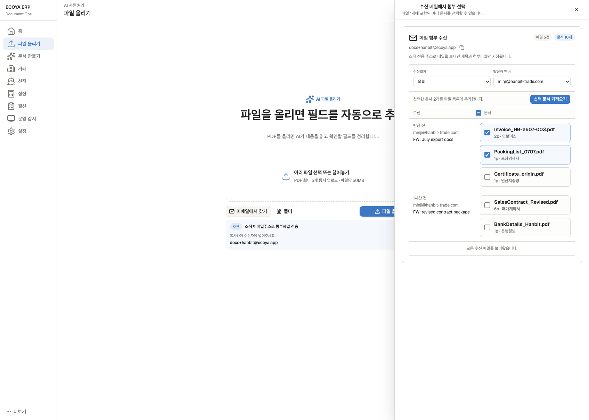

### 진입과 닫기

- `이메일에서 찾기`를 누르면 현재 화면을 밀지 않고 오른쪽 전체 높이 패널로 연다.
- `Esc`, 상단 닫기, 바깥 영역 클릭으로 닫는다. 선택 중인 파일이 있으면 닫기 전에 선택 유지 여부를 확인한다.

### 화면 구성

- 헤더: 조직 수신 주소와 복사 아이콘, 수신 메일 수·문서 수.
- 필터: 수신일자 범위, 발신자 멤버. 최초 진입은 로그인 멤버를 우선 적용한다.
- 목록: 한 메일에 여러 첨부가 매달리는 2열 구조. 메일 행 전체 선택과 첨부별 선택을 모두 지원한다.
- 상단 액션: 선택 개수와 `선택 문서 가져오기`를 스크롤 중에도 확인할 수 있게 고정한다.
- 더 보기: 페이지 번호 대신 하단 교차점 기반 무한 스크롤을 사용하며 로딩·재시도 상태를 제공한다.

### 수신 규칙

- 등록 멤버가 조직 주소로 보낸 메일만 자동 수락한다.
- 저장 범위는 제목, 발신자, 수신 시각, 첨부 메타데이터와 첨부 원본이다. 본문은 저장하지 않는다.
- 같은 메일 이벤트의 재전송은 provider message ID와 첨부 해시로 멱등 처리한다.
- 첨부가 없는 메일, 미등록 발신자, 감염 의심 파일은 각각 명확한 제외 상태로 남긴다.
- 가져온 문서는 U01 직접 업로드와 동일한 OCR 큐와 최근 파일 목록으로 합류한다.

## U03. 필드 검토와 PDF 대조

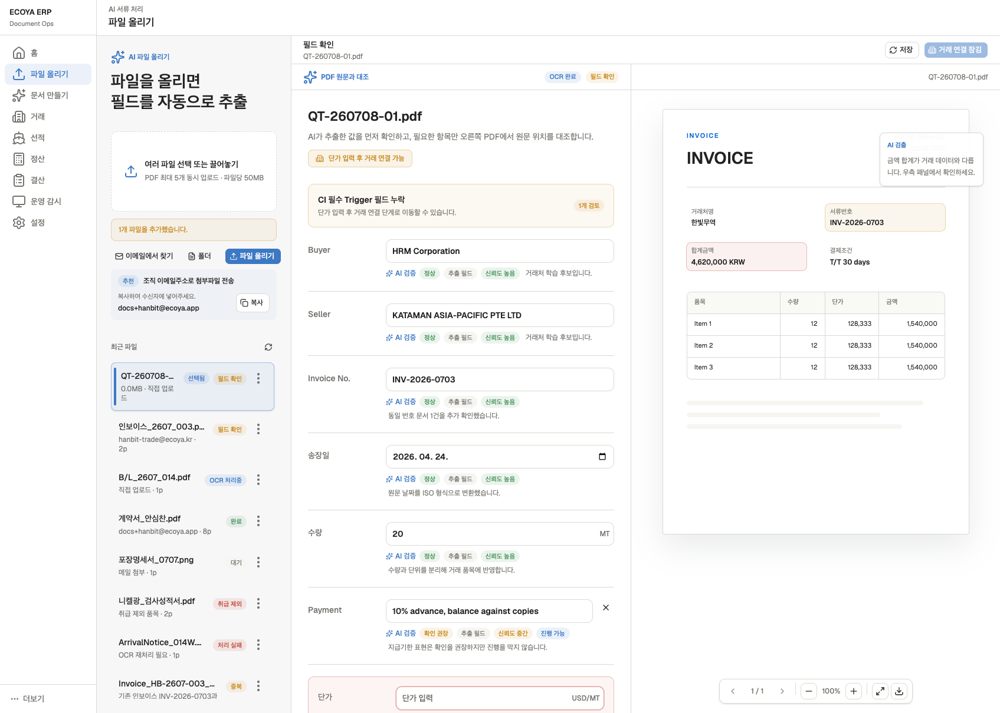

### 레이아웃

1. 상단: 현재 문서와 검토·배정 대기 문서 트레이.
2. 왼쪽: 추출 필드와 검토 상태.
3. 오른쪽: PDF 미리보기.

1024px 이상에서는 첫 진입부터 왼쪽 검토 / 오른쪽 PDF를 동시에 표시하며 경계선을 드래그해 폭을 조절한다. 1024px 미만에서는 `PDF 보기`와 `필드 검토`로 전환하고 입력값을 유지한다. 필드 선택과 실제 PDF 좌표의 양방향 강조는 별도 연동 확인이 필요한 기획 항목이다.

### 최근 파일 목록

- 목록 영역만 독립 스크롤하며 업로드 진입부는 고정한다.
- 선택 행은 배경, 왼쪽 표시선, `선택됨` 상태로 구분한다.
- 파일명, 유입 경로, 페이지 수, OCR 상태, 검토 상태를 표시한다.
- 세로 케밥 메뉴는 항상 노출하고 `삭제`를 포함한다. 삭제는 확인 후 소프트 삭제하고 복구 가능 시간을 안내한다.
- 서버 처리 상태는 폴링 또는 이벤트로 갱신하며 실패 시 재시도와 오류 원인을 제공한다.

### 필드 검토

- 문서 유형별 스키마에 따라 text, textarea, number, date, currency, quantity+unit, select, counterparty, line-item 타입을 렌더링한다.
- 필드 포커스 시 최근 사용값·거래값·확정 문서값·OCR값을 우선순위에 따라 최대 높이 팝오버로 제안한다.
- AI 검증은 별 아이콘과 `정상`, `확인 권장`, `누락`, `불일치` 라벨로 표시한다.
- 필수 Trigger 누락은 상단 요약과 해당 입력 바로 아래 오류로 함께 표시한다.
- 입력은 debounce 자동 저장하고 입력 안쪽에 `저장 중`, 체크, 실패 아이콘을 표시한다. 상단 `저장`은 즉시 저장한다.
- 변경 이력은 이전 값, 새 값, 사용자, 시각, 출처를 제공한다.

### PDF 제어

- 페이지 이전·다음과 현재/전체 페이지.
- 축소, 확대, 현재 배율.
- 전체 화면 진입과 명확한 닫기·Esc 복귀.
- 실제 샘플 PDF 다운로드.
- OCR 박스 선택 또는 필드 선택 시 양방향 위치 강조.

### 다음 단계 게이트

- 필수 Trigger가 비어 있으면 `거래 연결`을 비활성화하고 누락 필드로 이동하는 액션을 제공한다.
- 모든 필수값이 유효하면 `거래 연결`이 활성화된다.
- 거래 연결 단계에서도 필드값은 유지되며 `필드 수정`으로 되돌아갈 수 있다.

## U03-E. 처리 실패 복구 패널 · Figma 대조

디자인 기준: [04_검토패널 / Error Recovery (처리 실패), 3150:22884](https://www.figma.com/design/mqn2S73BOI4F02Xq6lNeMt/SNAP-2.0-%EC%9E%91%EC%97%85?node-id=3150-22884).

현재 접근: `문서 올리기 → ArrivalNotice_014W.pdf → 오류 확인`. 실패 화면은 아래 `u03-error`, 재시도는 `u03-retry`, 재추출 완료는 `u03-retried` 캡처를 확인합니다.

| 항목 | 현재 구현 | Figma 기준으로 필요한 작업 |
|---|---|---|
| 실패 표시 | 대기 목록의 처리 실패·오류 확인, 상세 실패 Alert | 왼쪽 패널 제목도 처리 실패로 구분 |
| 안내 문구 | 원본 유지·상단 다시 추출 안내 | ‘문서 처리 중 문제가 발생했어요. 다시 처리하거나 삭제할 수 있습니다.’ |
| 다시 추출 | 상세 상단에만 있음 | 실패 안내 안에 배치하고 처리 중 중복 실행 차단 |
| 문서 삭제 | 문서 목록 메뉴에서 확인 모달 후 실행 | 실패 안내 안에도 버튼 추가 → 확인 모달 → 선택 파일 제거, 다음 문서 또는 빈 목록으로 이동 |
| 오른쪽 원문 | PDF 미리보기 영역 유지 | 실제 원문 표시와 로딩·실패 상태 연결은 별도 검증 필요 |
| 파일 재업로드 | 실패 안내에 없음 | Figma 수정 메모에 따라 노출하지 않음 |
| 상세 오류·OCR 신뢰도 | 실패 안내에 없음 | Figma 수정 메모에 따라 노출하지 않음 |
| 3회 실패 후 수동 입력 | 없음 | 현재 지원 기능이 아니므로 노출하지 않음 |

**현재 실패 상태는 존재하지만, Figma의 실패 패널 내부 액션은 아직 적용되지 않았습니다.** 캡처는 이 차이를 숨기지 않고 현재 구현 그대로 기록합니다. 디자인 안의 `[수정요청 사항]` 박스는 제품 UI가 아닌 작업 메모이므로 화면에 구현하지 않습니다.

## U04. 거래 연결

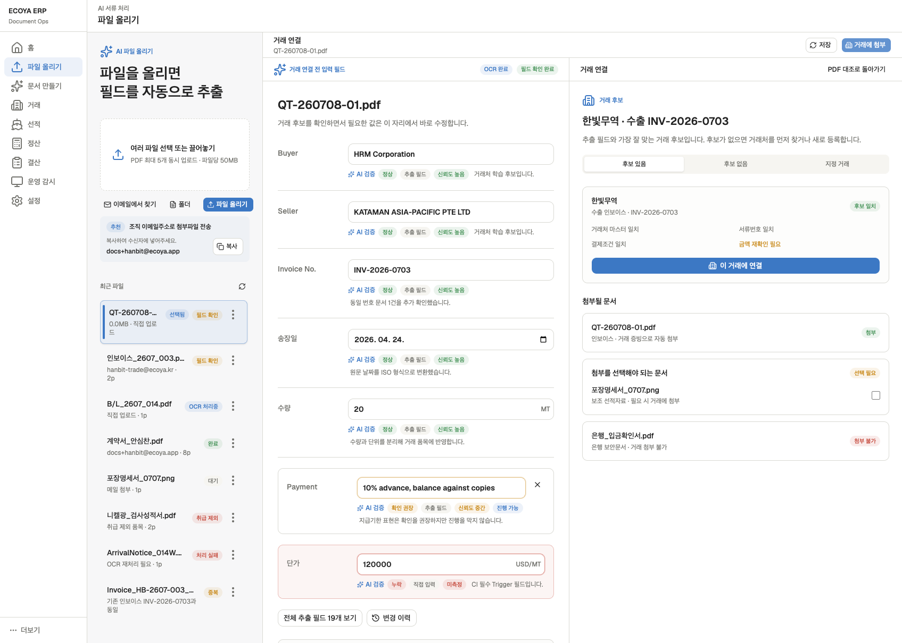

### 화면 구성

- 왼쪽: 검토한 문서의 PDF 미리보기. 상단 `항목 검토`로 돌아가면 왼쪽 필드 / 오른쪽 PDF 배치로 복귀한다.
- 오른쪽: 거래 후보와 거래처 매핑, 문서 첨부 정책, 최종 연결 액션.
- 상단 주요 버튼은 `거래 연결` 하나만 둔다. 같은 액션을 패널 하단에 중복하지 않는다.

### 거래 결정

| 상황 | 제공 액션 |
|---|---|
| 후보 1개, 높은 신뢰도 | 후보 근거를 보여주고 선택 상태로 시작 |
| 후보 여러 개 | 거래번호·거래처·금액·기간 근거를 비교해 한 건 선택 |
| 후보 없음 | 등록 거래처에서 찾기, 신규 거래처 등록, 거래 없이 보관 |
| 거래 지정 유입 | 지정 거래를 먼저 보여주되 조직·권한·상태를 재검증 |
| 오래된 후보 | 커밋 직전 최신 거래 상태를 다시 읽고 충돌 시 재선택 |

### 거래처 학습

- 문서 거래처명을 기존 거래처 마스터에 연결하거나 새 거래처로 등록한다.
- 주소 필드와 이름 필드는 같은 거래처 후보에 묶어 보여준다.
- 학습 실패는 거래 연결 실패와 분리하고 재시도 가능하게 남긴다.

### 문서 보관 정책

1. `자동 첨부`: 핵심 거래 증빙으로 항상 포함되는 문서.
2. `선택 첨부`: 사용자가 포함 여부를 선택하는 문서.
3. `첨부 불가`: 은행 보안문서 등 정책상 거래 첨부가 불가능한 문서. 사유를 표시한다.

### 커밋 결과

- 성공: 거래번호, 첨부 결과, 학습 결과를 기록하고 최근 파일 상태를 완료로 갱신한다.
- 중복 클릭: idempotency key로 한 번만 연결한다.
- 실패: 필드 수정 상태를 잃지 않고 거래 후보만 다시 조회한다.
- 권한·잠금 충돌: 누가 거래를 변경했는지 안내하고 새로고침 후 재확인한다.

## 파일 올리기 공통 예외

- 업로드 API bootstrap 실패와 재시도.
- OCR provider timeout, 추출 결과 없음, 원본 blob 누락.
- 파일은 성공했지만 일부 페이지만 실패한 부분 성공.
- 사용자가 목록에서 처리 중 파일을 삭제하거나 다른 탭에서 변경한 경쟁 상태.
- 지원하지 않는 품목·문서 유형의 취급 제외.
- 거래 연결 후 원문 보관 실패 또는 반대의 부분 커밋 방지.
- 다른 조직 파일·거래 접근 차단과 감사 로그.

## 화면 상태별 실제 캡처 · 2026-09-15

수정된 로컬 프로토타입에서 실제 조작해 캡처했습니다. 기본 1440 × 1000이며 다른 폭은 캡션에 표시합니다. 샘플 데이터·처리 시뮬레이션 기준으로, 실제 OCR·원문 파일 로딩·저장 API 성공을 증명하는 화면은 아닙니다. 기존 SVG는 이전 버전 참고입니다.

| 화면 ID | 상태 | 재현 방법 |
|---|---|---|
| [u01-entry](#screen-u01-entry) | 파일 올리기 · 대기 목록 | 메뉴 → 문서 올리기 |
| [u03-review](#screen-u03-review) | 파일 검토 · 최초 진입 | 인보이스 행 선택 → 검토 왼쪽 / PDF 오른쪽 |
| [u03-mismatch](#screen-u03-mismatch) | 파일 검토 · 불일치·필수값 누락 | 검토 영역 아래로 스크롤 → 수량·결제 예정일 확인 |
| [u03-desktop-1200](#screen-u03-desktop-1200) | 파일 검토 · 1200px | 브라우저 폭 1200px에서도 두 영역 표시 |
| [u03-mobile-fields](#screen-u03-mobile-fields) | 파일 검토 · 모바일 필드 | 390px → 기본 검토 영역 |
| [u03-mobile-pdf](#screen-u03-mobile-pdf) | 파일 검토 · 모바일 PDF | PDF 보기 → 원문 전환 |
| [u04-connect](#screen-u04-connect) | 거래 연결 · 후보 선택 | 검토 완료 문서 → PDF 왼쪽 / 거래 연결 오른쪽 |
| [u03-processing](#screen-u03-processing) | 파일 검토 · OCR 처리 중 | 분석 중 B/L → 처리 보기 |
| [u03-error](#screen-u03-error) | 파일 검토 · 처리 실패 | 도착통지 → 오류 확인 |
| [u03-retry](#screen-u03-retry) | 파일 검토 · 재시도 중 | 처리 실패 → 다시 추출 |
| [u03-retried](#screen-u03-retried) | 파일 검토 · 재추출 완료 | 재추출 완료 → 필드 검토로 복귀 |

### u01-entry · 파일 올리기 · 대기 목록

진입: 메뉴 → 문서 올리기. 화면 폭: 1440 × 1000.

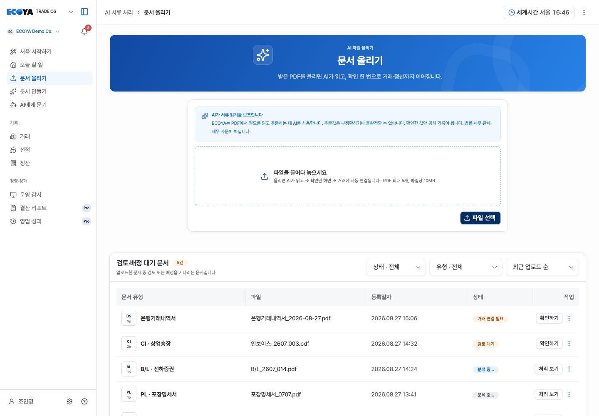

### u03-review · 파일 검토 · 최초 진입

진입: 인보이스 행 선택 → 검토 왼쪽 / PDF 오른쪽. 화면 폭: 1440 × 1000.

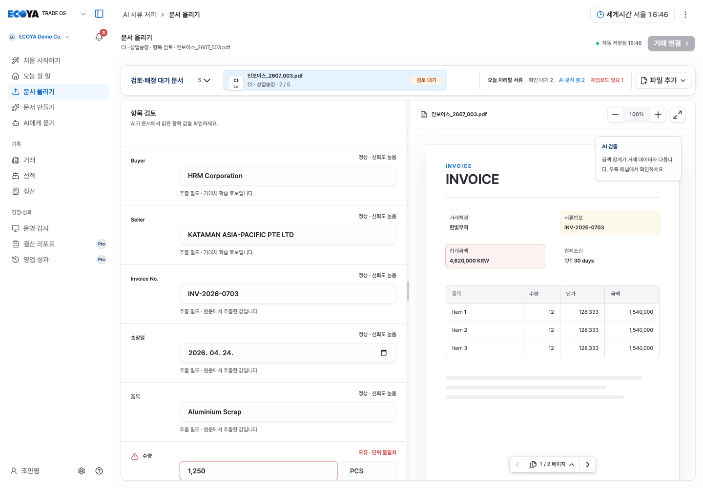

### u03-mismatch · 파일 검토 · 불일치·필수값 누락

진입: 검토 영역 아래로 스크롤 → 수량·결제 예정일 확인. 화면 폭: 1440 × 1000.

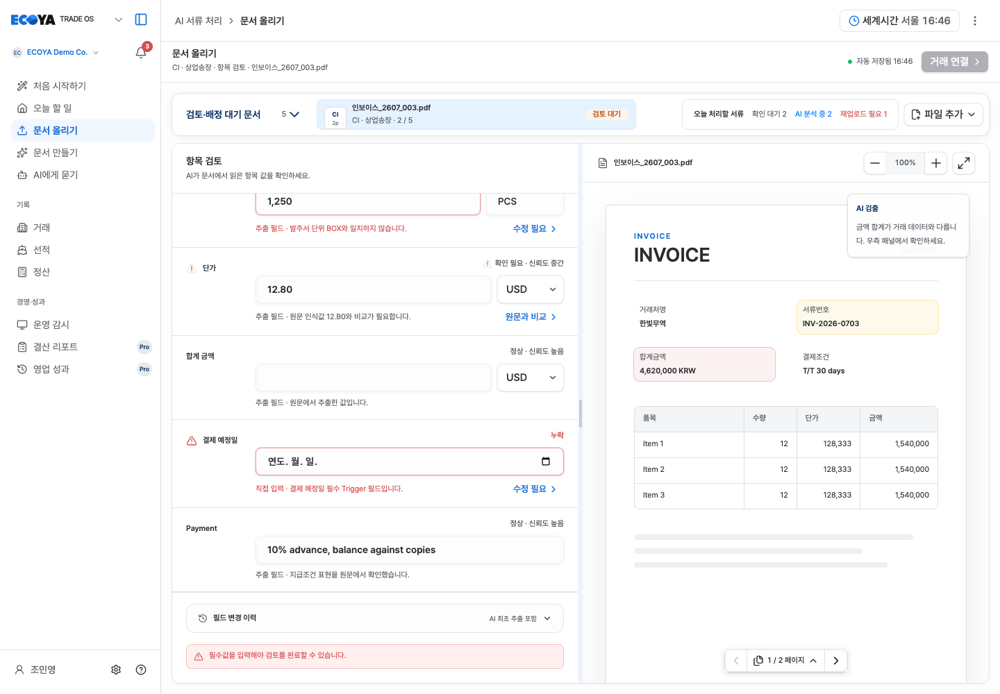

### u03-desktop-1200 · 파일 검토 · 1200px

진입: 브라우저 폭 1200px에서도 두 영역 표시. 화면 폭: 1200 × 1000.

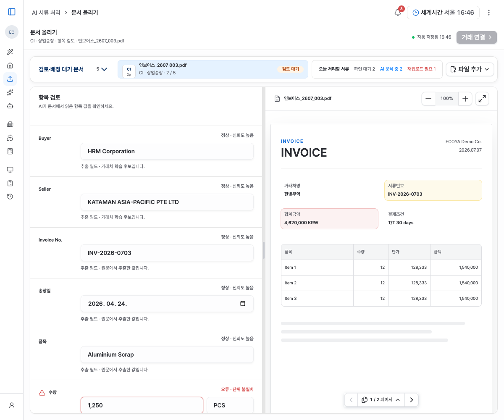

### u03-mobile-fields · 파일 검토 · 모바일 필드

진입: 390px → 기본 검토 영역. 화면 폭: 390 × 844.

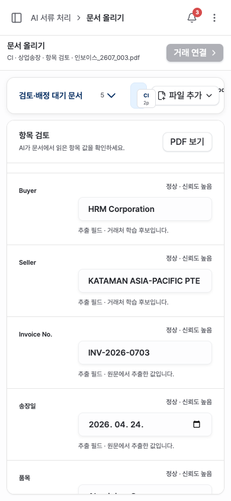

### u03-mobile-pdf · 파일 검토 · 모바일 PDF

진입: PDF 보기 → 원문 전환. 화면 폭: 390 × 844.

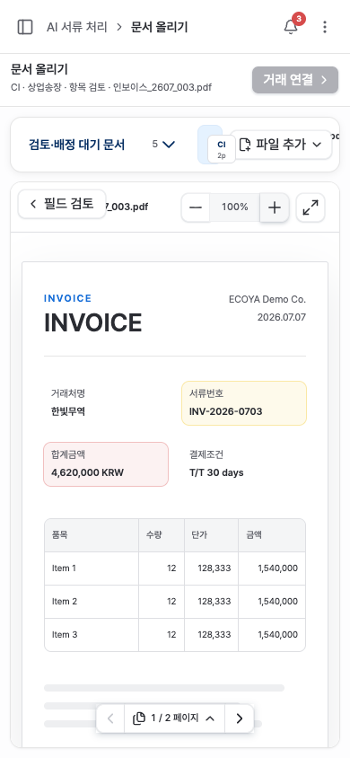

### u04-connect · 거래 연결 · 후보 선택

진입: 검토 완료 문서 → PDF 왼쪽 / 거래 연결 오른쪽. 화면 폭: 1440 × 1000.

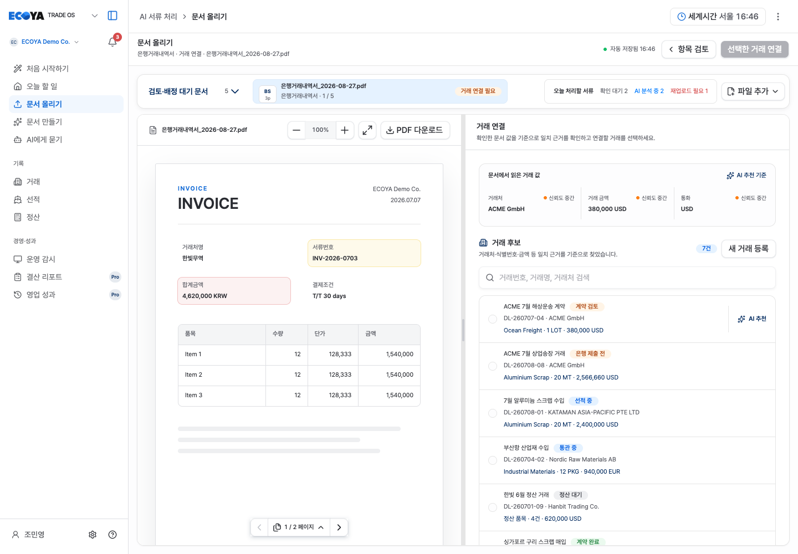

### u03-processing · 파일 검토 · OCR 처리 중

진입: 분석 중 B/L → 처리 보기. 화면 폭: 1440 × 1000.

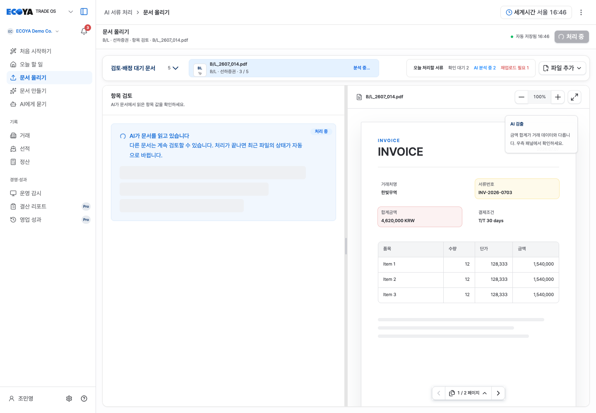

### u03-error · 파일 검토 · 처리 실패

진입: 도착통지 → 오류 확인. 화면 폭: 1440 × 1000.

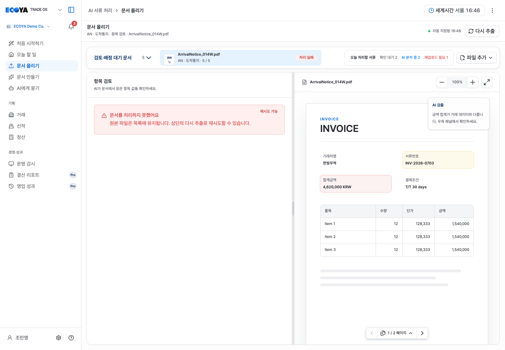

### u03-retry · 파일 검토 · 재시도 중

진입: 처리 실패 → 다시 추출. 화면 폭: 1440 × 1000.

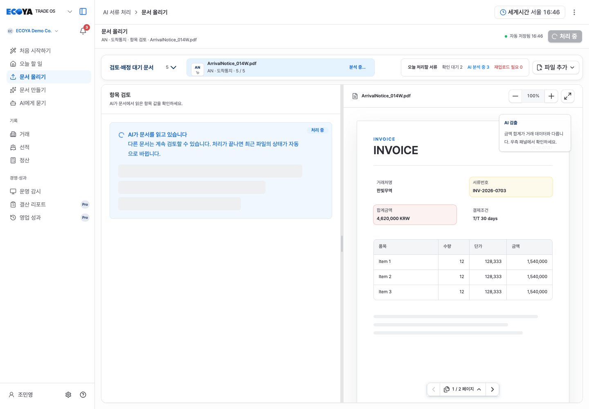

### u03-retried · 파일 검토 · 재추출 완료

진입: 재추출 완료 → 필드 검토로 복귀. 화면 폭: 1440 × 1000.

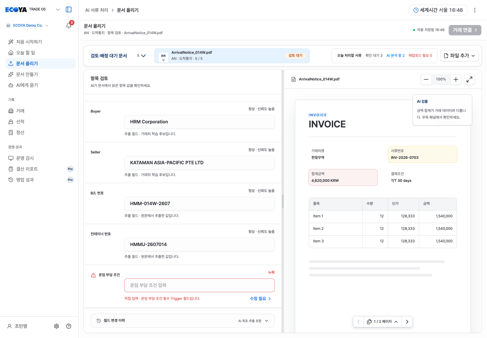

### 캡처가 없는 상태

수신 메일 패널·실제 원문 로딩 실패·서버 저장 실패·권한 충돌·거래 연결 커밋 완료는 이번 캡처에 포함하지 않았습니다. 위 기능 규칙의 목표 상태이며, 캡처가 있다는 이유로 백엔드 구현 완료로 해석하지 않습니다.

## G53 3030 앱 상태 샘플

최신 요청 대상인 `http://localhost:3030/erp/home`의 10개 상태와 캡처는 [G53 로컬 케이스 기획서](./g53-local-case-preview.md)에 별도로 기록했습니다. 이 문서의 5175 프로토타입과 다른 실행 앱입니다.

## 2026-09-17 가격·확정 흐름 반영

진입 화면에 파일 올리기 → 추출값 검토 → 거래 연결·확정의 3단계를 표시한다.
은행내역은 문서 확정과 입출금 적용을 구분하며, ‘서류만 연결’도 가능하다.
자동 저장은 검토값 저장이고 거래 확정이 아니다. 금액/통화/수량의 검토와
파일별 실패·중복·재추출 상태를 기존 검토 작업 화면과 연결한다.
