# G53 · 3030 문서 상태 샘플

2026-09-15. [홈](http://localhost:3030/erp/home) → **문서 올리기** → **검토·배정 대기 문서 10건**에서 확인합니다.

[문서 목록 바로 열기](http://localhost:3030/erp/inbox).

G53의 기존 UI에 로컬 메모리 API로 넣은 샘플입니다. 실제 DB/OCR 결과 또는 Figma 실패 패널 적용 완료를 뜻하지 않습니다. 기존 프로토타입(5175)의 캡처와 구분합니다.

현재 실패 문서는 목록 행의 **다시 추출·삭제** 버튼으로 처리합니다. 01번은 재시도 → 분석 중 → 검토 대기로 전환되고, 08·09번은 재시도 불가 사유를 보여 줍니다. 02·03번은 현재 UI에서 같은 ‘분석 중’ 표시를 사용합니다.

## 홈 진입

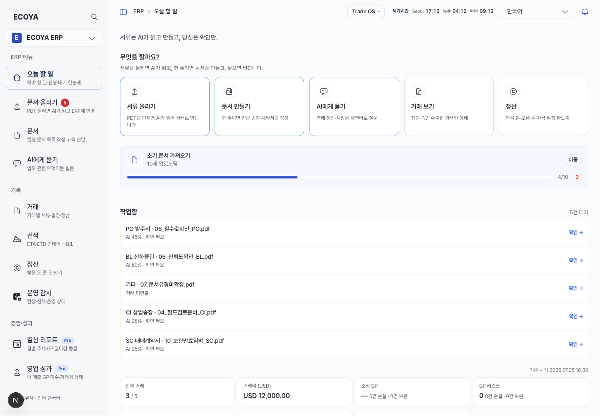

## PDF와 필드 검토

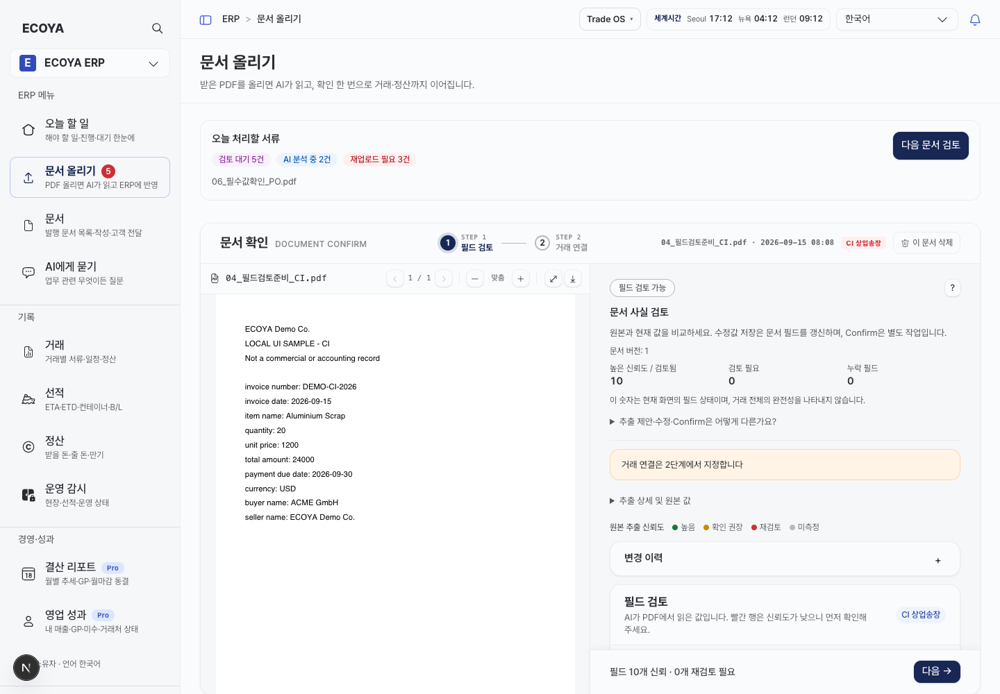

## 목록 상태 10개

### 01. 처리 실패 · 재시도 가능

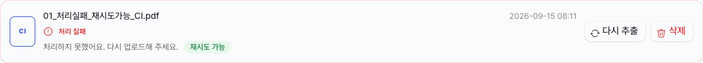

### 02. AI 분석 중

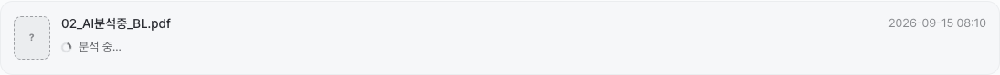

### 03. 분석 대기

### 04. 필드 검토 준비

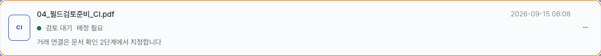

### 05. 신뢰도 확인

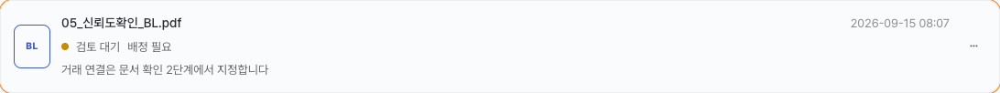

### 06. 필수 수량 누락

### 07. 문서 유형 미확정

### 08. 원본 파일 없음

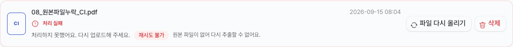

### 09. 재시도 3회 소진

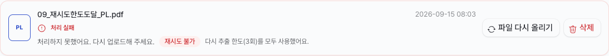

### 10. 보관 만료 임박

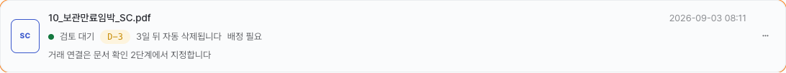

## 재시도와 삭제 확인

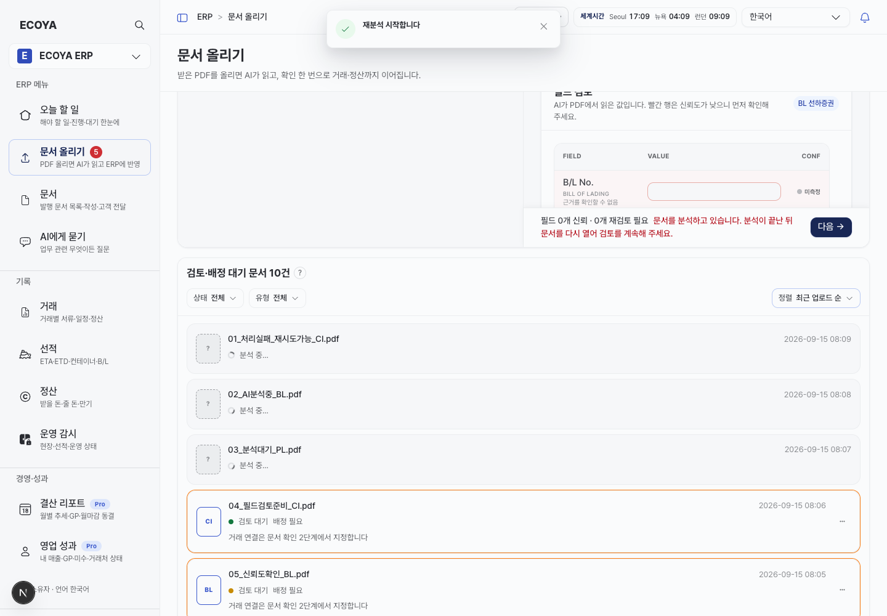

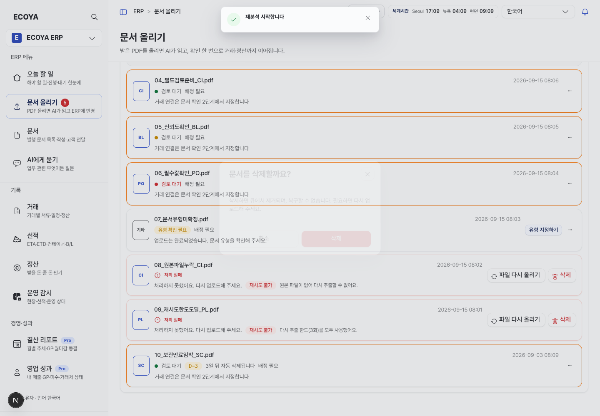

## 좁은 화면 · 390px

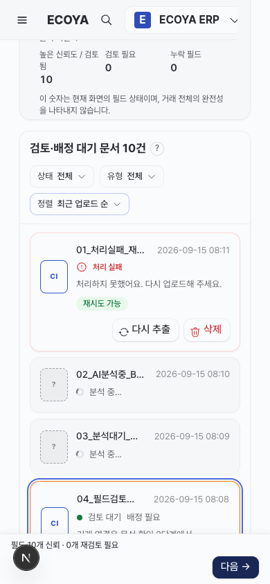

검증: 목록 10건, 홈→문서 목록 이동, PDF 렌더링, 재시도 상태 전환, 삭제 확인 후 제거, 390px 페이지 가로 넘침 없음. 브라우저 페이지 오류 없음. 테스트 뒤 10건으로 복원했습니다.

새 파일 업로드·문서 확정·정산 쓰기는 이 샘플 API의 지원 범위 밖입니다. 기존 홈 테스트의 다른 지표는 문서 샘플과 별개입니다.
