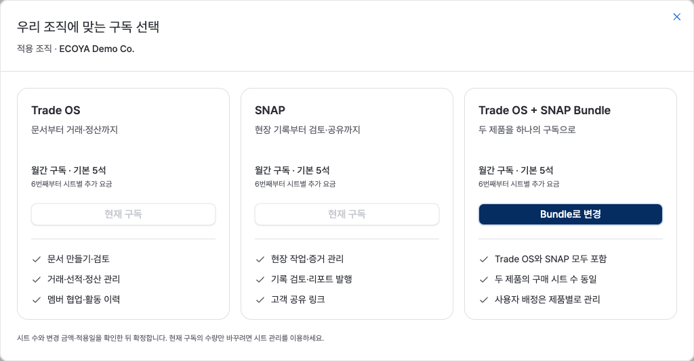
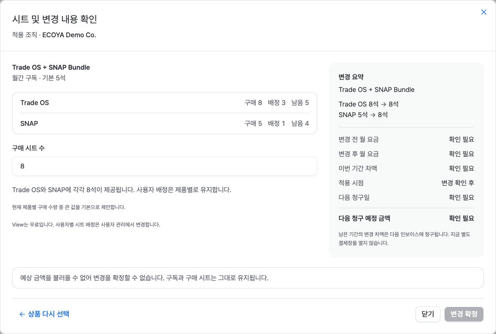
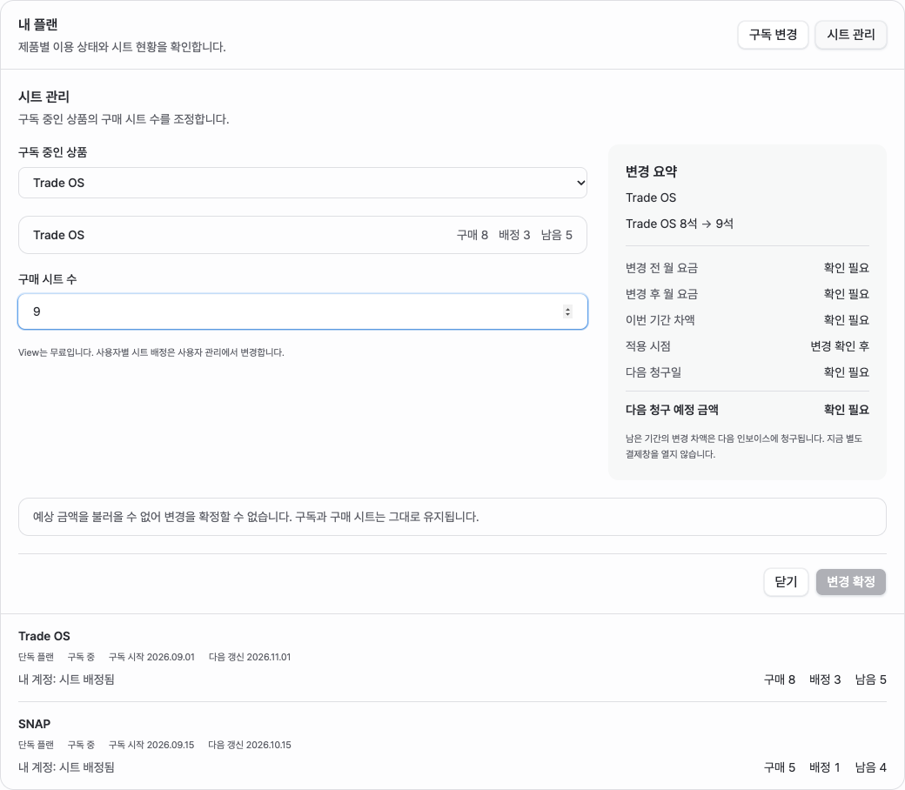
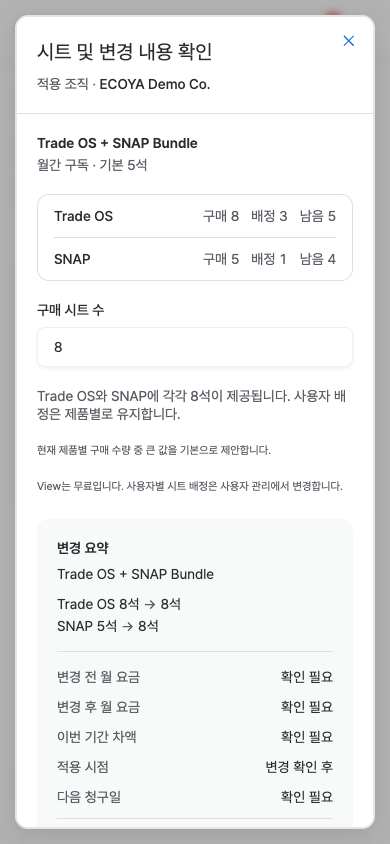

# 구독 변경과 시트 관리 — 2026-10-08

## 반영한 화면

- `/erp/settings?section=products`의 `구독 변경`: 현재 조직을 유지한 상품 비교 창 → 시트 확인·청구 요약.
- `시트 관리`: 현재 유료 구독의 수량을 같은 화면에서 인라인 조정.
- 기존 유료 구독은 `변경 확정`, 신규 구독은 `결제 계속하기`로 구분.
- 단독→Bundle은 제품별 구매 수량 중 큰 값을 기본 제안. Bundle→각각 구독은 독립 수량 입력·다음 갱신 적용.
- 구매·배정·남은 수량과 무료 View 구분. 금액·구독 변경 API가 미연결이므로 금액은 확인 필요, 확정은 비활성.
- 사용자 관리 표·초대 구조와 기존 공통 색상 유지.

## SSOT와 API

`hrm-corp/ecoya-products`의 `COMMON:DEC-SUBSCRIPTION-CHANGE-001`과 Common CS-20의 `Paddle 구독 변경 API 연결`에 정책·호출·예외를 기록했다.

- [변경 예상 금액 조회](https://developer.paddle.com/api-reference/subscriptions/preview-subscription-update/)
- [기존 구독 변경](https://developer.paddle.com/api-reference/subscriptions/update-subscription/)
- [변경 후 구독·다음 청구 조회](https://developer.paddle.com/api-reference/subscriptions/get-subscription/)
- [일할 계산·차기 청구 옵션](https://developer.paddle.com/concepts/subscriptions/proration/)

API 문서가 있다는 사실은 ECOYA 서버 연동 완료를 뜻하지 않는다. 예약 감소와 여러 구독의 통합·분리는 별도 서버 흐름과 Sandbox 검증이 필요하다.

## 검증

- `npm run build` 통과.
- 설정 계약 검사 16개 통과. 상품 비교/시트 인라인, Bundle 분리, OWNER/ADMIN, 신규 구독, 금액 미확인 확정 차단을 포함.
- 데스크톱 1440×1000, 모바일 390×844 확인. 모바일 창 내부 스크롤, 가로 넘침 없음, 단계 이동 시 제목으로 초점·스크롤 복귀.
- 아래 캡처는 로컬 디자인 실행의 예시 데이터이며 실제 구독·결제 성공 증거가 아니다.

## 화면 캡처

### 상품 비교

### 시트·청구 확인

### 기존 구독 시트 관리

### 모바일

